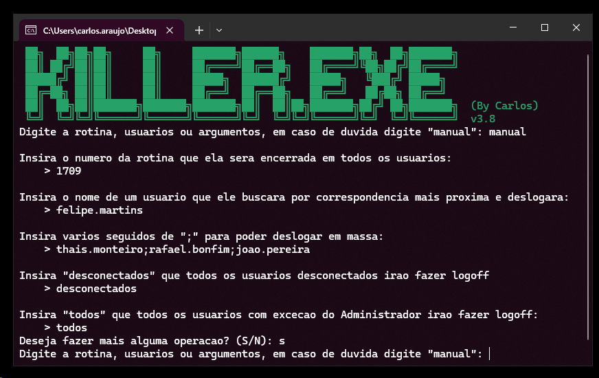

#  Killer.exe

**Killer.exe** é um aplicativo compilado a partir de um script em PowerShell para encerramento de rotinas do ERP **Winthor** (Totvs) em servidores de conetores remoto em núvem.
O objetivo desta aplicação é evitar o uso do **Gerenciador de Tarefas** `taskmgr.exe` em um ambiente de Terminal Services.
Pois o Windows Server não suporta mais de cinquenta usuários logados, causando extrema lentidão ao abrir e usar o gerenciador.
Além de livrar do uso de `taskkill`, pois ele é extremamente burro e não reconhece usuários, grupos e políticas.

## Capturas de Tela

Aplicativo com a tela inicial exibindo o manual de uso para o usuário.



## Compilando o PowersShell script para binário

Por conta de políticas de segurança do Microsoft Windows, o PowerShell vem desativado por padrão para execução de scripts sem certificados válidos.
Sendo necessário alterar o parâmetro `executionpolicy` para `unrestricted`, usando `set-executionpolicy unrestricted`.
Portanto foi indispensável a compilação para binários e acelerar a execução dele em qualquer máquina, simplesmente dando duplo clique.

1. **Reserve um diretório**:

    ```
    Killer.exe-main
    | -- ..
    | -- Killer.ico
    | -- Killer.ps1
    ```

2. **Abra o PowerShell e execute o ps2exe**:

    ```
    ps2exe .\Killer.ps1 .\Killer.exe -Icon .\Killer.ico
    ```
## ⚠️ Atenção
Killer.exe pode ser identificado como um **malware** por causa de seu comportado de encerrar programas e controle de usuários.
Recomendo deixá-lo na **whitelist** de seu antivírus.
O programa só surtirá efeito, sendo executado como *administrador* da máquina ou do domínio.
